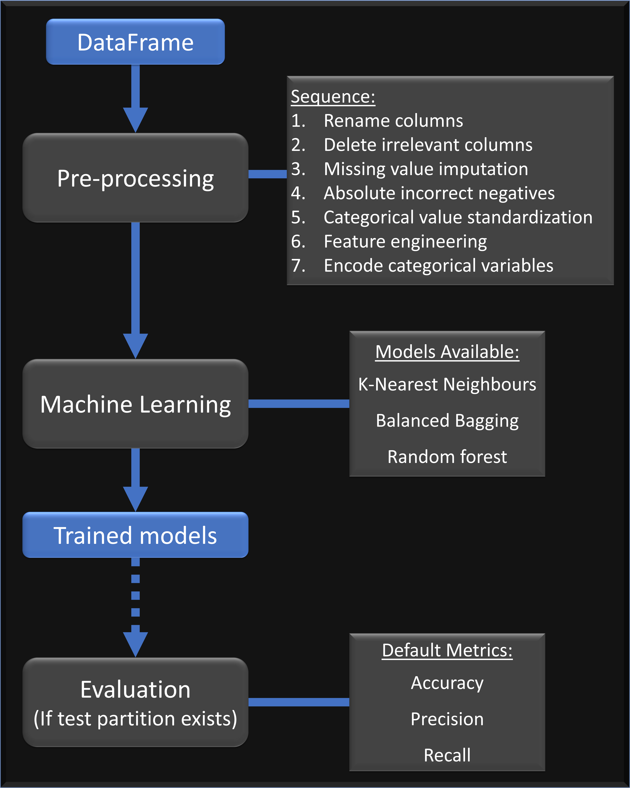
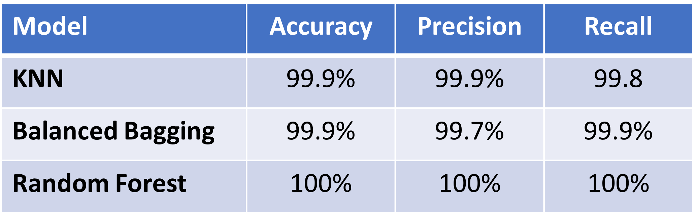

<H2> A. Particulars </H2>

<H3>Full Name: Karthik Prathaban<br>
Email Address: karthik93@outlook.sg

<H2> B. Folder Structure </H2>

```
├── src
│   ├── main.py              # Runs program (preprocessing -> machine learning -> model evaluation)
│   ├── config.YAML          # Document for user to define pre-processing / machine learning parameters
│   ├── machine learning
│   │   ├── __init__.py
│   │   ├── models.py        # Trains machine learning models
│   ├── preprocessing 
│   │   ├── __init__.py
│   │   ├── preprocess.py    # Pre-processes DataFrame 
│   ├── evaluation
│   │   ├── __init__.py
│   │   ├── model_eval.py    # Evaluates trained models
├── data
│   ├── survive.db           # Survive database
├── eda.ipynb                # Exploratory data analysis
├── README.md
├── requirements.txt
└── run.sh
```

<H2> C. Instructions for Executing Pipeline </H2>

1. Ensure python3 is installed: ```$ sudo apt-get install python3```
2. Navigate to the source folder (e.g. ```$ cd /mnt/c/exampleuser/documents/AIAP_Improved_Karthik_Prathaban``` in WSL)
3. Install required packages from the provided requirements folder: ```$ pip install -r requirements.txt```
4. *Optional*: Open **config.yaml** in the **/src** subfolder and alter the processing, machine learning and testing parameters per your preference 
5. Ensure run.sh is executable: ```chmod u+x run.sh```
6. Run the program ```./run.sh```

<H2> D. Steps / Flow of Pipeline </H2>



<H2> E. EDA Findings </H2>
<H3>  Data  errors </H3>

1. Mssing values were observed for 'Creatinine'
2. Negative values were observed for 'Age'
3. Outliers were detected for Sodium, Platelets and Creatinine phospokinase but fell within reasonable clinical values
4. Inconsistencies were detected in Categorical Features: Survive, Smoke and Ejection Fraction (variable spelling or use of numbers and text for the same value)

<H3> Data distributions </H3>

1. Sodium, platelets, weight, creatine phospokinase and creatinine were found to possess skewed distributions
2. Majority of the patients were found to belong to the class that did not survive (> twice the number who survived)
3. Data was imbalanced for Ejection Fraction (EF), with ~88%: Low, ~12%: Normal and 0%: High

<H3> Correlations with Surival </H3>

1. Weak positive correlations observed between BMI and survival outcomes (0.59 - Pearson)
2. Patients with Low/Normal EF were significantly more likely to survive if Ejection Fraction > ~30 

<H2> F. Choice of ML Models </H2>

<H3> K-Nearest Neighbours (KNN)</H3>

The K-Nearest Neighbours algorithm is a simple classifier that does not make any assumptions concerning the  decision 
boundary dividing  classes, which in this case hasn't yet been established. 

<H3> Random Forest</H3>

The utilization of a rule-abased approach ensures that feature scaling or normalization does not have to be performed 
with the use of a random forest classifier, which is also capable of performing robustly even with the presence of
missing values or outliers (present in this dataset but not fully addressed during the preprocessing stage)

<H3>Balanced Bagging</H3>

The balanced bagging ensemble model fits the decision tree classifier on random subsets of the dataset without
replacement. Predictions on the subsets are aggregated to form the final predictions. This (just like the random forest)
accounts for imbalances in the data classes (observed with the Survival variable) to improve classification performance. 

<H2> G. Model Evaluation </H2>


<H3> Metrics used </H3>

1. Accuracy is an easy to interpret default metric for measuring the classifier's performance on test data
2. Precision gives us a ratio of the number of correctly predicted positive observations to total positive observations, depicting the extent that the model incorrectly classifies patients who did not survive
3. Recall gives insights into whether the classifier is predicting survival correctly amongst the cohort of patients who did survive, depicting the extent that the model incorrectly classifies patients who did survive

In addition: Detailed metrics such as the confusion matrix or f1_score can be obtained through functions in the evaluation folder. The user may call for these variable to be displayed through the *config* file. 

<H2> H. Other Considerations </H2>
 
1. Note that the n_neighbours value has been set to 5 for this preliminary analysis. Using a small value for this creates the risk of overfitting. A higher value would regularize the decision boundary, preventing overfitting but increasing the risk of bias. Cross-validation may be used in the future to evaluate the optimal value
2. As the test data and training data were obtained from the same dataset, it is hard to ascertain whether the models are performing well on test data coming from the same distribution.Testing the model on data from other institutions would help validate it's robustness. 

<H2> Update </H2>

1. **src/preprocessing/preprocess.py**: <br>Preprocessing is now implemented using object-oriented programming. Processing methods run automatically, in a pre-determined order, but results from the application of each method can now be called through the console for evaluation <br><br>
2. **src/preprocessing/preprocess.py**: <br>Ordinal variables are now created through dictionary comprehension to give the user the ability to input custom ranges for their own ordered categories. <br><br>
3. **src/preprocessing/preprocess.py**: <br>The global scope is used to update the list of categorical & numerical columns from the feature engineering method before label encoding to allow for more custom features<br><br>
4. **src/machine-learning/models.py & src/evaluation/model_eval.py**: <br>The training and evaluation methods for ML models are defined as functions with user-definable parameters, such as the choice to display brief or detailed evaluation metrics<br><br>
5. **requirements.txt**: <br>Requirements is manually written (as opposed to conda generated previously) to exclude redundant packages & dependencies and ensure compatibility with pip install